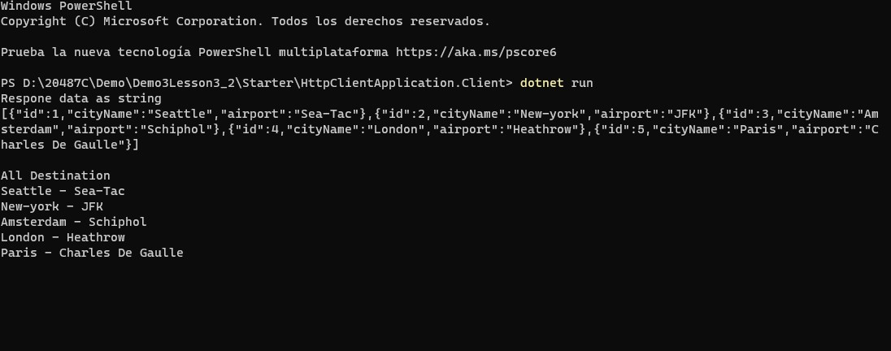

# Module 3: Creating and Consuming ASP.NET Core Web APIs

# Lesson 3: Consuming ASP.NET Core Web APIs 

### Demonstration: Consuming Services by Using HttpClient

- Abrimos el proyecto HttpClientApplication.Client en Visual Studio Code 
- Añadimos el paquete **Microsoft AspNet WebApi Client**
- Creamos una nueva instancia en el main de **HttpClient** 
- Creamos una peticion GET
- Leemos la respuesta y la deserializamos
- Ejecutamos el proyecto  HttpClientApplication.Host para que atienda las peticiones
- Ejecutamos el proyecto HttpClientApplication.Client 

